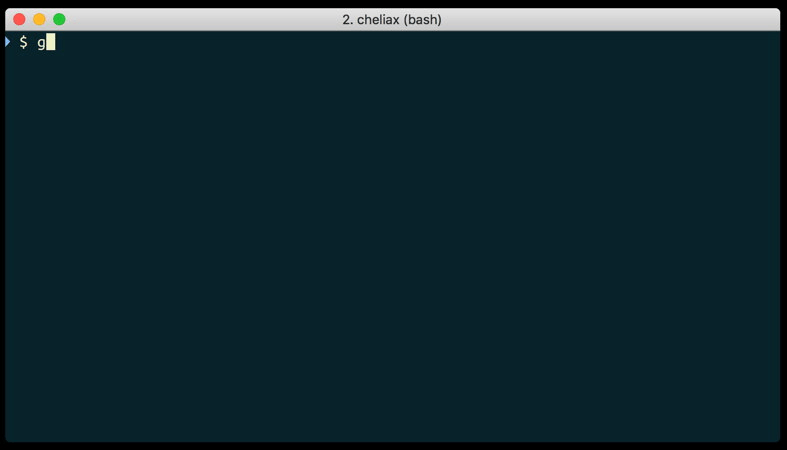

# gcfg: quick gcloud configuration switcher

**gcfg** is a very small shellscript that utilizes [fzf](https://git.io/C4FBDw)
to conveniently switch between gcloud configurations.

It is directly inspired by the Kubernetes namespace switcher [kns](https://github.com/blendle/kns).

## Demo


## Installation
To install **gcfg** you can just run this command:
```bash
curl https://raw.githubusercontent.com/cmeury/gcfg/master/bin/gcfg -o /usr/local/bin/gcfg && chmod +x $_
```

Then, run `gcfg`.

